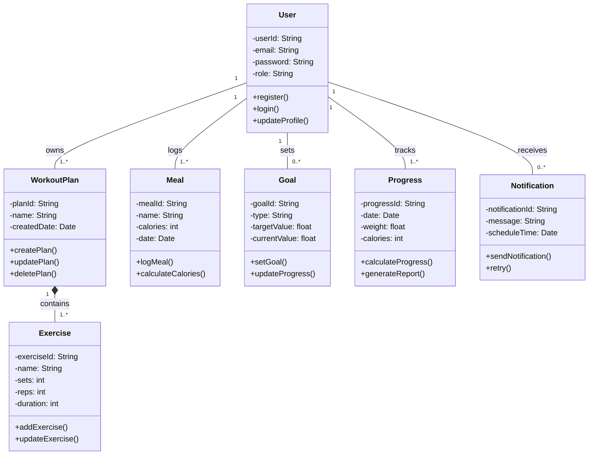

# Domain Model & Class Diagram – FitPlan

---

## Domain Model

### Overview

The Health Habit Tracker system operates within the health and fitness domain and manages user fitness data, including workouts, meals, goals, and progress tracking.

---

## Domain Entities

| Entity       | Attributes                              | Methods                                  | Relationships                       |
| ------------ | --------------------------------------- | ---------------------------------------- | ----------------------------------- |
| User         | userId, email, password, role           | register(), login(), updateProfile()     | Has many WorkoutPlans, Meals, Goals |
| WorkoutPlan  | planId, name, createdDate               | createPlan(), updatePlan(), deletePlan() | Belongs to User, contains Exercises |
| Exercise     | exerciseId, name, sets, reps, duration  | addExercise(), updateExercise()          | Part of WorkoutPlan                 |
| Meal         | mealId, name, calories, date            | logMeal(), calculateCalories()           | Belongs to User                     |
| Goal         | goalId, type, targetValue, currentValue | setGoal(), updateProgress()              | Belongs to User                     |
| Progress     | progressId, date, weight, calories      | calculateProgress(), generateReport()    | Linked to User                      |
| Notification | notificationId, message, scheduleTime   | sendNotification(), retry()              | Sent to User                        |

---

## Relationships

* A **User** can have multiple WorkoutPlans (1..*)
* A **WorkoutPlan** contains multiple Exercises (1..*)
* A **User** logs multiple Meals (1..*)
* A **User** sets multiple Goals (0..*)
* A **User** has Progress records over time (1..*)
* A **User** receives Notifications (0..*)

---

## Business Rules

* A user must be authenticated before accessing system features
* A user can create multiple workout plans but must have at least one active plan
* Meal entries must include calorie values (auto or manual)
* Daily calorie totals must be calculated dynamically
* Goals must track progress as a percentage
* Notifications must be triggered based on user schedules
* System must prevent duplicate user accounts (unique email)

---

## Class Diagram

---

## Design Decisions

* **Composition (WorkoutPlan → Exercise):** Exercises cannot exist without a workout plan.
* **Association (User → Meal, Goal, Progress):** These entities exist independently but are linked to the user.
* **Separation of Concerns:** Each class handles a single responsibility (e.g., Meal handles nutrition tracking).
* **Scalability Consideration:** Modular design allows future features like AI recommendations or wearable integrations.

---

## Conclusion

The domain model and class diagram provide a clear representation of the system structure, ensuring alignment with previous requirements, use cases, and Agile planning.
