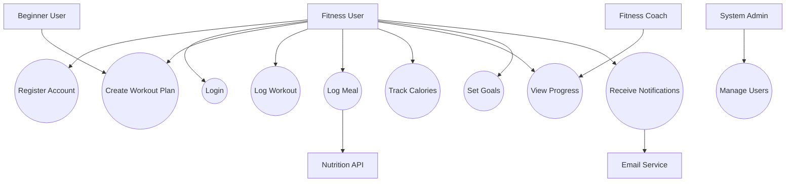

# Use Case Diagram – Health Habit Tracker

## Diagram

---

## Explanation

### Key Actors

* **Fitness User**: Primary user interacting with all the system features.
* **Beginner User**: Subtype of user needing simplified system interactions.
* **Fitness Coach**: Monitors user progress.
* **System Admin**: Manages system users and operations.
* **Nutrition API**: External system providing nutrition food data.
* **Email Service**: Sends out notifications.

---

### Relationships

* **Include Relationship**:
  Logging the meals is dependent on fetching nutritional data from the Nutrition API.

* **External Interaction**:
  Notifications rely on the Email Service.

* **Actor Specialization**:
  Beginner User is a specialized type of Fitness User.

---

### Stakeholder Alignment

This diagram addresses:

* Users need for **tracking workouts and meals**
* Coaches need for **monitoring progress**
* Admins need for **system control**
* System integration concerns (API + notifications)

